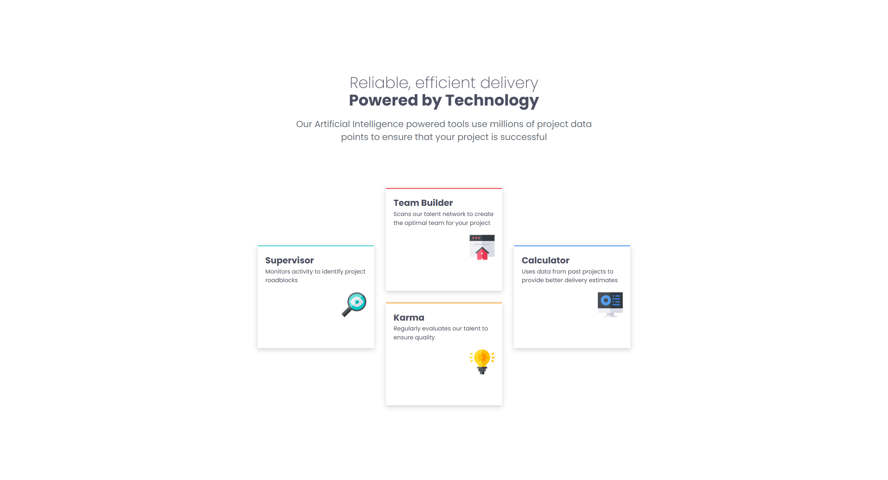
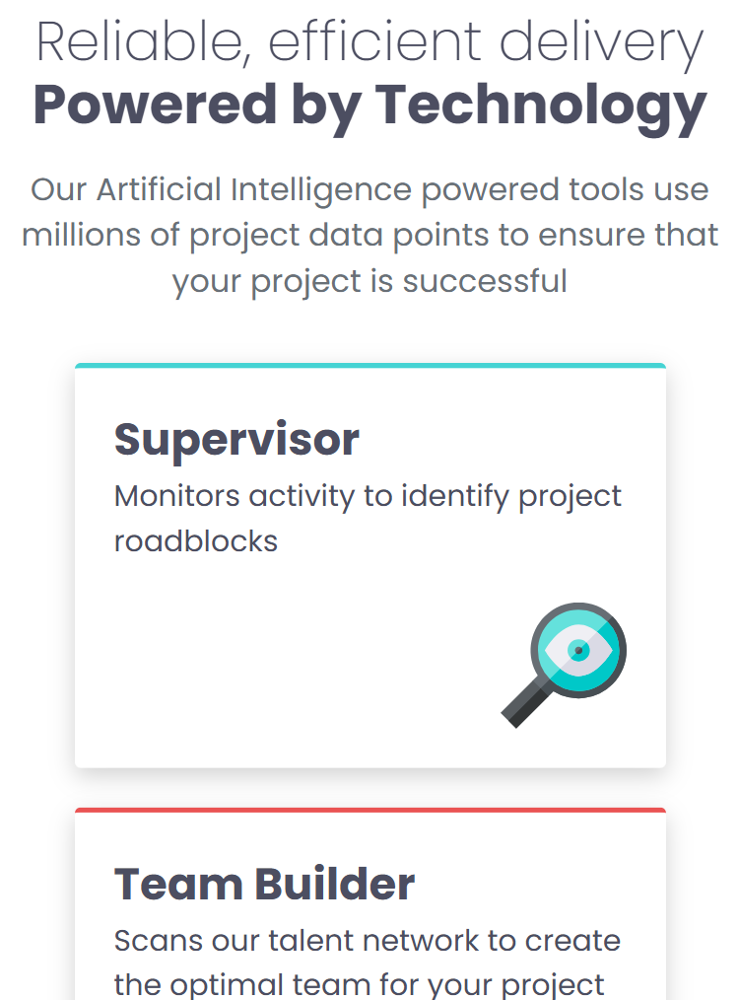

# Frontend Mentor - Four card feature section solution

This is a solution to the [Four card feature section challenge on Frontend Mentor](https://www.frontendmentor.io/challenges/four-card-feature-section-weK1eFYK). Frontend Mentor challenges help you improve your coding skills by building realistic projects.

## Table of contents

- [Overview](#overview)
  - [The challenge](#the-challenge)
  - [Screenshot](#screenshot)
  - [Links](#links)
- [My process](#my-process)
  - [Built with](#built-with)
  - [What I learned](#what-i-learned)
  - [Continued development](#continued-development)
  - [Useful resources](#useful-resources)
- [Author](#author)
- [Acknowledgments](#acknowledgments)

**Note: Delete this note and update the table of contents based on what sections you keep.**

## Overview

This project is a responsive four-card feature section built as part of a Frontend Mentor challenge. The goal was to create a visually appealing layout that adapts seamlessly to different screen sizes using modern CSS techniques. The section highlights four distinct features, each represented by a card with an icon, title, and description. The design emphasizes clean structure, accessibility, and maintainable code.

### The challenge

Users should be able to:

- View the optimal layout for the site depending on their device's screen size

### Screenshot




### Links

- Solution URL: [https://github.com/remainhumble/Four-card-feature-section]
- Live Site URL: [https://remainhumble.github.io/Four-card-feature-section]

## My process

### Planning

I began by carefully reviewing the challenge requirements and analyzing the provided design. I planned a mobile-first approach to ensure responsiveness.

### Development

- Built the card components using semantic HTML and styled them with CSS Grid and Flexbox for flexible layouts.
- Implemented responsive design using media queries and CSS custom properties.
- Added accessibility features such as proper alt text for images and logical heading structure.

### Testing & Refinement

I tested the layout across multiple devices and browsers, making adjustments for consistency and accessibility. I also refactored code for readability and maintainability.

### Deployment

Finally, I deployed the project using Github Pages.

### Built with

- Semantic HTML5 markup
- CSS custom properties
- Flexbox
- CSS Grid
- Mobile-first workflow

### What I learned

Throughout this project, I deepened my understanding of responsive web design, particularly using CSS Grid and Flexbox together for complex layouts. I learned how to structure semantic HTML for accessibility and how to use CSS custom properties for easier theme management. Additionally, I improved my workflow by adopting a mobile-first approach.

```css
.container {
  display: grid;
  grid-template-columns: repeat(3, 1fr);
  grid-template-rows: repeat(5, 1fr);
  grid-gap: 1.875rem;
  max-width: 62.5rem;
  max-height: 31.25rem;
  transform: scale(0.7);
}

.card1 {
  grid-column: 1 / 2;
  grid-row: 2 / 4;
  margin: 0;
}

.card2 {
  grid-column: 2 / 2;
  grid-row: 1 / 3;
  margin: 0;
}

.card3 {
  grid-column: 2 / 3;
  grid-row: 3 / 5;
  margin: 0;
}
.card4 {
  grid-column: 3 / 4;
  grid-row: 2 / 4;
  margin: 0;
}
```

### Continued development

In future projects, I want to continue focusing on:

- Deepening my understanding of advanced CSS Grid and Flexbox layouts for more complex responsive designs.
- Improving accessibility by learning more about ARIA roles and best practices for inclusive web development.
- Refining my use of CSS custom properties for scalable and maintainable theming.
- Exploring component-based design systems to streamline development and ensure consistency across projects.
- Experimenting with modern CSS features like container queries and logical properties as browser support improves.

### Useful resources

- [Grid by Example](https://gridbyexample.com/) - Rachel Andrew has created an extremely comprehensive CSS Grid resource. It includes examples, patterns, and tutorials and is a great resource to bookmark and refer to repeatedly.

## Author

- Frontend Mentor - [@remainhumble](https://www.frontendmentor.io/profile/remainhumble)
- X(formerly Twitter) - [@thiflan120699](https://x.com/thiflan120699)
